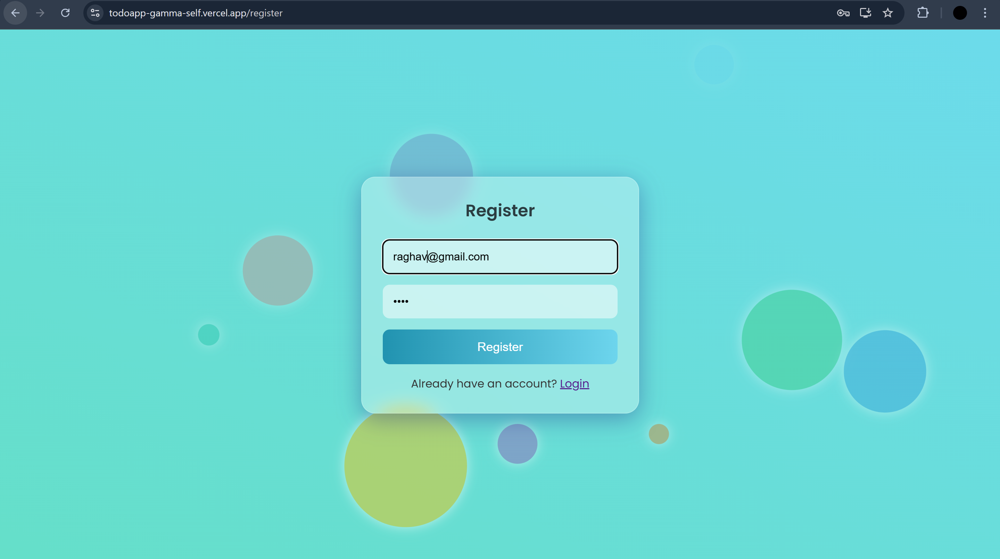
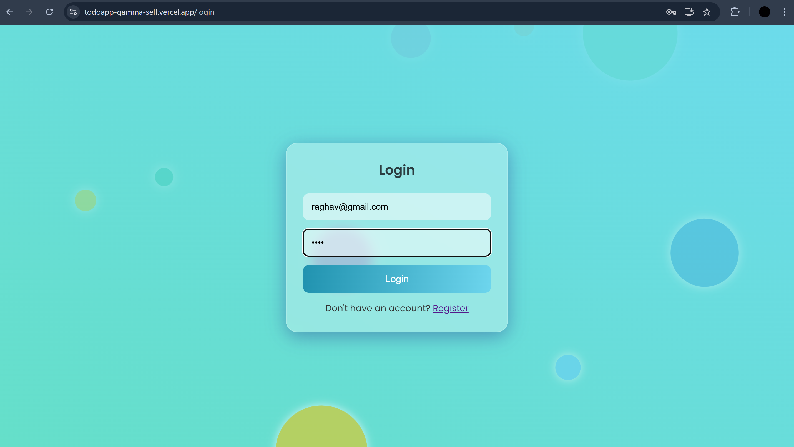
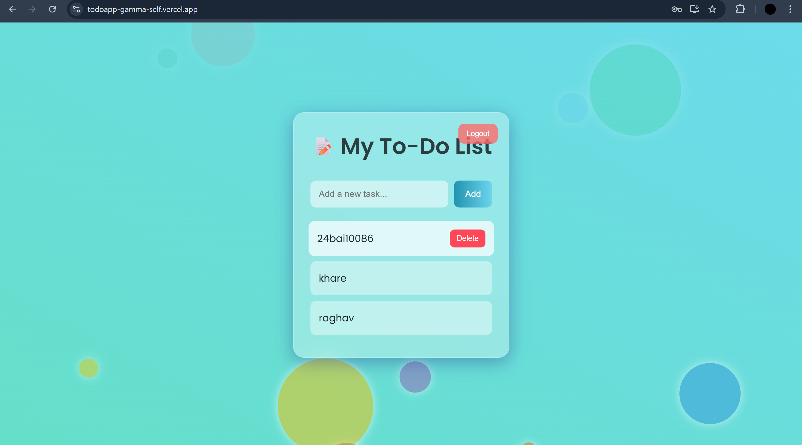

# Interactive To-Do List Application

A full-stack, interactive to-do list application built with the MERN stack (MongoDB, Express.js, React.js, Node.js). This project allows users to sign up, log in, and manage their own private list of tasks.







> **Note:** If a blank screen appears, please clear your browser cookies for this site and refresh the page.

## 🌐 Live Website
👉 [Visit TODO-App here](https://todoapp-gamma-self.vercel.app/)

## ✨ Features

* **Secure User Authentication:** Users can register and log in with an email and password. The system uses JSON Web Tokens (JWT) for secure session management.
* **Individual Task Lists:** Each user's to-do list is completely private. You can only view and manage the tasks you create.
* **Create & Delete Tasks:** Easily add and remove tasks from your personal list.
* **Data Persistence:** Tasks are stored in a MongoDB database and linked to your user account.
* **RESTful API:** A secure backend API built with Node.js and Express to handle user and task logic.

---

## 🛠️ Tech Stack

* **Frontend:** React.js, CSS
* **Backend:** Node.js, Express.js, JWT, bcryptjs
* **Database:** MongoDB (with Mongoose)
* **Deployment:** Vercel (Frontend), Render (Backend)

---

## 🔧 Getting Started

### Prerequisites

* Node.js (v14 or later)
* npm (Node Package Manager)
* A free MongoDB Atlas account

### Setup and Installation

1.  **Clone the repository:**
    ```bash
    git clone [https://github.com/YourUsername/your-repo-name.git](https://github.com/YourUsername/your-repo-name.git)
    cd your-repo-name
    ```

2.  **Install Backend Dependencies:**
    Navigate to the `server` directory and install the required packages.
    ```bash
    cd server
    npm install
    ```

3.  **Set Up Environment Variables:**
    Create a `.env` file in the `server` directory and add your MongoDB connection string and a JWT secret.
    ```
    MONGO_URI=your_mongodb_connection_string
    JWT_SECRET=your_super_secret_jwt_key
    ```

4.  **Install Frontend Dependencies:**
    Navigate to the `client` directory and install the required packages.
    ```bash
    cd ../client
    npm install
    ```

5.  **Run the Application:**
    * To start the backend server (from the `server` directory): `npm start`
    * To start the frontend development server (from the `client` directory): `npm start`

The application will be running with the frontend on `http://localhost:3000` and the backend on `http://localhost:5000`.

---

## API Endpoints

The backend server exposes the following RESTful API endpoints. Task-related routes are protected and require authentication.

| Method | Endpoint             | Description                                     |
| :----- | :------------------- | :---------------------------------------------- |
| `POST` | `/api/users/register`| Registers a new user.                           |
| `POST` | `/api/users/login`   | Logs in a user and returns a JWT.               |
| `GET`  | `/api/tasks`         | Fetches all tasks for the logged-in user.       |
| `POST` | `/api/tasks`         | Adds a new task for the logged-in user.         |
| `DELETE`| `/api/tasks/:id`    | Deletes a task by ID for the logged-in user.    |